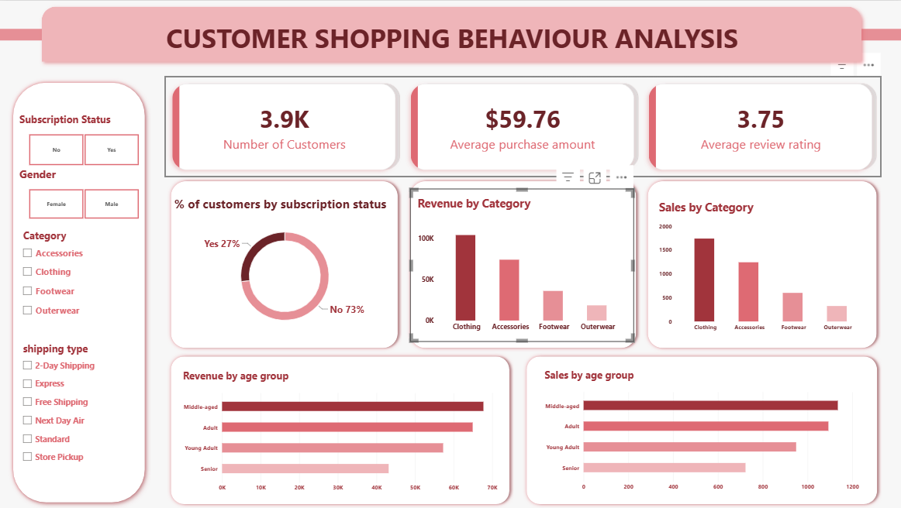

# customer-shopping-behavior-analysis

An end-to-end data analytics project that analyzes customer purchasing behavior to identify spending patterns, customer segments, product preferences, discount behavior, subscription trends, and revenue drivers.

The project follows a complete analytics workflow using **Python, Pandas, PostgreSQL, SQL, and Power BI**.

---

##  Project Overview

The objective of this project is to transform raw customer transaction data into meaningful business insights that can support decision-making.

The dataset contains **3,900 purchase records across 18 columns**, covering customer demographics, purchase information, shopping behavior, ratings, subscriptions, and shipping preferences.

The analysis focuses on answering practical business questions such as:

* Which customer groups generate the most revenue?
* How does spending differ by gender?
* Which products receive the highest ratings?
* Do Express-shipping customers spend more than Standard-shipping customers?
* How do subscribers compare with non-subscribers?
* Which products are most dependent on discounts?
* How can customers be segmented based on purchase history?
* Which products are most frequently purchased within each category?
* Are repeat buyers more likely to subscribe?
* Which age groups contribute the most revenue?

---

##  Tools & Technologies

| Tool                 | Purpose                                     |
| -------------------- | ------------------------------------------- |
| **Python**           | Data cleaning, preparation, and exploration |
| **Pandas**           | Data manipulation and analysis              |
| **PostgreSQL**       | Database storage and SQL analysis           |
| **SQL**              | Business-focused data analysis              |
| **Power BI**         | Interactive dashboard and visualization     |
| **Jupyter Notebook** | Python analysis workflow                    |

---

##  Project Workflow

```text
Raw Dataset
     ↓
Data Exploration
     ↓
Data Cleaning & Preparation
     ↓
Feature Engineering
     ↓
PostgreSQL Integration
     ↓
SQL Business Analysis
     ↓
Power BI Dashboard
     ↓
Business Recommendations
```

---

##  Data Cleaning & Preparation

The dataset was prepared in Python before performing the business analysis.

### Key data preparation steps

* Loaded the dataset using Pandas.
* Inspected the dataset structure using `df.info()`.
* Reviewed descriptive statistics using `.describe()`.
* Checked for missing values.
* Imputed missing `Review Rating` values using the median rating for the corresponding product category.
* Standardized column names using `snake_case`.
* Created an `age_group` feature by grouping customers based on age.
* Created a `purchase_frequency_days` feature.
* Checked the relationship between `discount_applied` and `promo_code_used`.
* Removed `promo_code_used` after identifying redundancy.
* Connected Python with PostgreSQL.
* Loaded the cleaned DataFrame into PostgreSQL for SQL-based analysis.

---

##  SQL Business Analysis

The cleaned dataset was analyzed in PostgreSQL to answer business-focused questions.

### 1. Revenue by Gender

Compared total revenue generated by male and female customers.

### 2. High-Spending Discount Users

Identified customers who used discounts but still spent above the average purchase amount.

### 3. Top 5 Products by Rating

Identified products with the highest average customer review ratings.

### 4. Shipping Type Comparison

Compared average purchase amounts between Standard and Express shipping.

### 5. Subscribers vs. Non-Subscribers

Compared customer count, average spending, and total revenue across subscription groups.

### 6. Discount-Dependent Products

Identified the five products with the highest percentage of discounted purchases.

### 7. Customer Segmentation

Classified customers into:

* **New**
* **Returning**
* **Loyal**

based on their purchase history.

### 8. Top 3 Products per Category

Identified the three most purchased products within each product category.

### 9. Repeat Buyers & Subscriptions

Examined whether customers with more than five purchases were more likely to subscribe.

### 10. Revenue by Age Group

Calculated the total revenue contribution from each customer age group.

---

##  Power BI Dashboard

The final analysis was presented through an interactive Power BI dashboard.

### Dashboard Features

* Total customer count
* Average purchase amount
* Average review rating
* Subscription status distribution
* Revenue by category
* Sales by category
* Revenue by age group
* Sales by age group
* Gender filtering
* Category filtering
* Shipping-type filtering
* Subscription-status filtering

### Dashboard Preview



---

##  Key Business Insights

The analysis highlighted several important patterns:

* **Clothing** generated the highest revenue and sales among the analyzed categories.
* **Non-subscribers** represented the larger customer base and contributed more total revenue because of their substantially larger population.
* **Express shipping** showed a higher average purchase amount than Standard shipping.
* **Loyal customers** represented the largest customer segment.
* **Young Adult and Middle-aged customers** were among the strongest revenue-contributing age groups.
* Certain products showed a high dependence on discounts, indicating opportunities to review promotional strategies.
* Highly rated products can be prioritized in promotional campaigns.

---

##  Business Recommendations

### 1. Boost Subscription Adoption

Promote exclusive subscriber benefits and personalized offers to encourage non-subscribers to join.

### 2. Strengthen Customer Loyalty

Introduce loyalty rewards for repeat customers to encourage movement into the Loyal segment.

### 3. Optimize Discount Strategy

Review discount-heavy products and balance promotional activity with profitability and margin protection.

### 4. Improve Product Positioning

Give greater visibility to highly rated and frequently purchased products in marketing campaigns.

### 5. Target High-Value Customer Groups

Focus marketing efforts on high-revenue age groups and customer groups showing stronger purchasing behavior.

---

##  Project Structure

```text
customer-shopping-behavior-analysis/
│
├── data/
│   └── customer_shopping_behavior.csv
│
├── python/
│   └── customer_shopping_behavior_analysis.ipynb
│
├── sql/
│   └── customer_behavior_analysis.sql
│
├── powerbi/
│   └── customer_behavior_dashboard.pbix
│
├── images/
│   └── dashboard.png
│
├── documentation/
│   └── Customer_Shopping_Behavior_Analysis.pdf
│
└── README.md
```

---

##  Skills Demonstrated

**Data Analysis**

* Exploratory Data Analysis
* Data Cleaning
* Feature Engineering
* Customer Segmentation
* Business Analytics

**Technical Skills**

* Python
* Pandas
* SQL
* PostgreSQL
* Power BI
* Data Visualization
* Jupyter Notebook

**Business Skills**

* KPI Analysis
* Revenue Analysis
* Customer Behavior Analysis
* Business Question Framing
* Insight Generation
* Data-Driven Recommendations

---

##  Author

**Vanshika Kapil**

Aspiring Data Analyst | SQL | Power BI | Python | Excel

[LinkedIn](www.linkedin.com/in/vanshika-kapil-bb56ba353)

